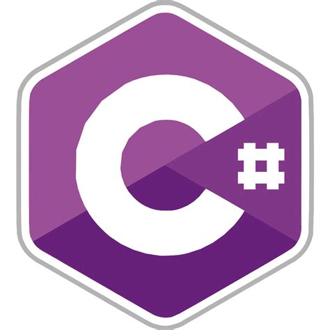
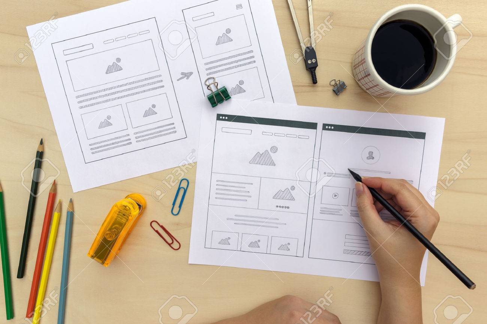

## Who am I?

>"I'm a greater believer in luck, and I find the harder I work
>the more I have of it" -Thomas Jefferson

I am a passionate Computer Programmer who loves to create new applications and explore new concepts. I believe that hard work pays off
in the end and that no obstacle is insurmountable.

<form method="get" action="Beatriz-Morales-Resume.docx">
   <button type="submit" style="background-color:#FCDFFF">Download Resume</button>
</form>
<form method="get" action="Beatriz-Morales-Coverletter.docx">
   <button type="submit" style="background-color:#82CAFA">Download Coverletter</button>
</form>
   

   <h2>Projects</h2>
   

  

  

    

      
       <h3> <a href="https://github.com/beatriz2889/angular-project">Video Game Lobby</a></h3>
      
Using Angular JS along with the MEAN stack I created a video game lobby that allows users to add a player and join other player's games

    

  

  

    

      
      <h3><a href="https://github.com/beatriz2889/gbc-parking-app">GBC Parking Reservation Application</a></h3>
      
Using the MEAN stack I have developed a web parking reservation application for George Brown College as part of my capstone project.

    

  

  

    

      
       <h3><a href="https://github.com/beatriz2889/chat-room">Socket io Chat Room</a></h3>
      
Chat room application developed using socket io and MERN stack.

    

  

  

    

      
       <h3><a href="https://github.com/beatriz2889/Airline-Booking-System">Airline Booking System</a></h3>
      
Small airline booking system application using C#

    

  

  

    

      
       <h3><a href="https://github.com/beatriz2889/Bank-Application">Bank Application</a></h3>
      
Simple bank application using Java

    

  

   <h2>Capstone Summary</h2>
   

  

  

    

      
       <h3> <a href="https://github.com/beatriz2889/beatriz2889.github.io/blob/master/capstone-docs/T28_Project%20Vision-converted.pdf">Project Vision</a></h3>
    

  

  

    

      
      <h3><a href="https://github.com/beatriz2889/beatriz2889.github.io/blob/master/capstone-docs/T28_High%20Level%20Requirements-converted.pdf">Project Requirements</a></h3>
    

  

  

    

      
      <h3><a href="https://github.com/beatriz2889/beatriz2889.github.io/blob/master/capstone-docs/T28_Project%20Plan%26Charter-converted.pdf">Project Plan</a></h3>
    

  

  

  

    

      
       <h3> <a href="https://github.com/beatriz2889/beatriz2889.github.io/blob/master/capstone-docs/T28_Requirements%20Analysis%20and%20Design-converted.pdf">Requirements Analysis & Design</a></h3>
    

  

   

  

    

      
       <h3> <a href="https://github.com/beatriz2889/beatriz2889.github.io/blob/master/capstone-docs/F19_T28_MockUp.pdf">Wireframes</a></h3>
    

  

  

  

    

      
       <h3> <a href="https://github.com/beatriz2889/beatriz2889.github.io/tree/master/capstone-docs/status-reports">Status Reports</a></h3>
    

  

  

  

    

      
       <h3> <a href="https://github.com/beatriz2889/gbc-parking-app">System Implementation</a></h3>
    

  

     
                                                                                                                                         
                                             
                                             
         
                                                     
                                                
   
   

   

