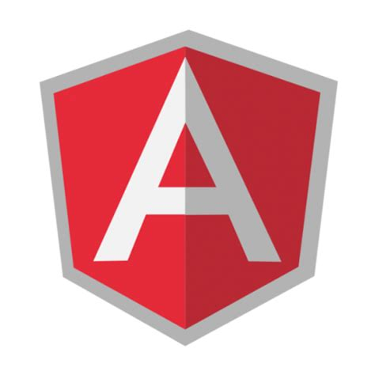

# Beatriz Morales 

## Who am I?

>"I'm a greater believer in luck, and I find the harder I work
>the more I have of it" -Thomas Jefferson

I am a passionate Computer Programmer who loves to create new applications and explore new concepts. I believe that hard work pays off
in the end and that no obstacle is insurmountable.

<form method="get" action="Beatriz-Morales-Resume.docx">
   <button type="submit" style="background-color:yellow">Download Resume</button>
</form>
<form method="get" action="Beatriz-Morales-Coverletter.docx">
   <button type="submit" style="background-color:pink">Download Coverletter</button>
   

   <h3>Projects</h3>
   

  

  

    

      
      <h3>Gamer Lobby</h3>
      
Using Angular JS along with the MEAN stack I created a gamer lobby that allows users to add a player and join other player's games

    

  

  

    

      
      <h3>GBC Parking Reservation Application</h3>
      
Using the MEAN stack I have developed a web parking reservation application for George Brown College as part of my capstone project.

    

  

  

    

      
      <h3>My Work</h3>
      
Lorem ipsum..

    

  

  

    

      
      <h3>My Work</h3>
      
Lorem ipsum..

    

  

   
   
   <a href="https://github.com/beatriz2889/angular-project">Gamer Lobby Application using Angular</a>
   <a href="https://github.com/beatriz2889/gbc-parking-app">Parking Reservation Web Application for George Brown College using Angular MEAN Stack</a>
   

